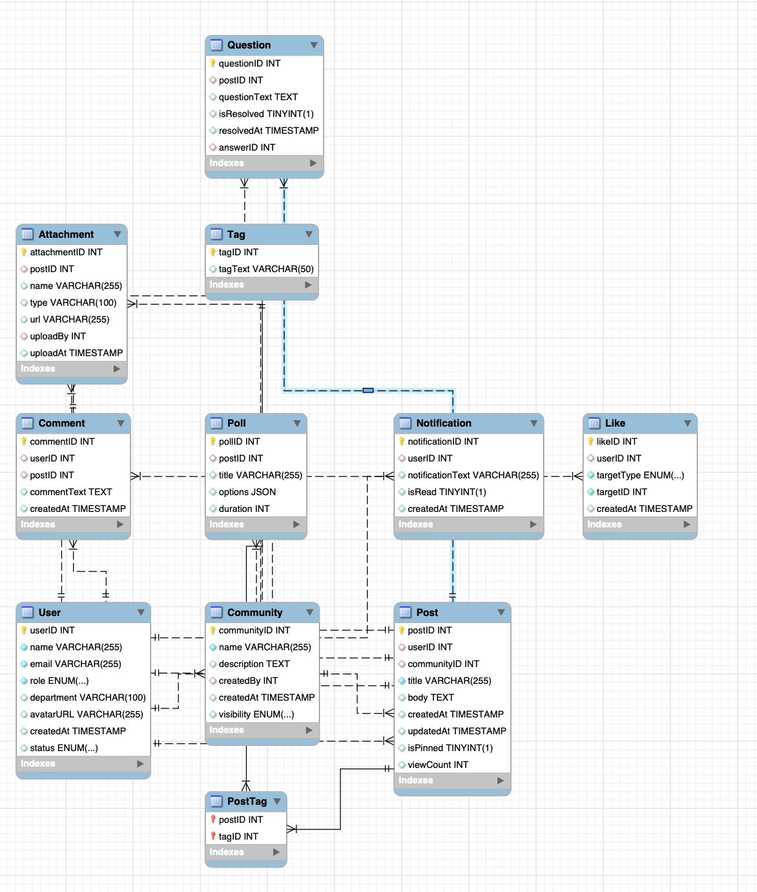

# Viva-Engage Sample Database  
*(COS20031 – Group LexusTech)*

A compact **MySQL 8** schema that models the core data of an internal
“Viva Engage”-style collaboration platform (users, communities, posts,
comments, polls, notifications, etc.).  
Ships with realistic mock data so you can query immediately.

---

## 1 Folder layout

```
viva-engage-db/
├─ README.md              – this file
├─ schema/                – pure DDL (one table per file)
│  ├─ 00_cleanup.sql
│  ├─ 01_user.sql
│  ├─ 02_community.sql
│  ├─ …
│  └─ 11_question.sql
├─ seed/                  – INSERT statements (mock data)
│  ├─ users.sql
│  ├─ communities.sql
│  ├─ …
│  └─ questions.sql
└─ data/                  – same rows as CSV (optional loader)
   ├─ users.csv
   ├─ communities.csv
   ├─ …
   └─ questions.csv
```

> *Choose either* **`seed/*.sql`** *or* **`data/*.csv`** – you don’t need both.

---

## 2 Prerequisites

* MySQL 8.0 / MariaDB 10.6+  
* A schema you **already own**  
  (edit every `USE my_schema;` line to match).

---

## 3 Quick start (all-in-one)

```bash
# full_setup.sql is just schema/* then seed/* concatenated
mysql -u <user> -p <your_schema> < full_setup.sql
```

---

## 4 Modular run (file-by-file)

```bash
# 1) Drop any old tables
mysql -u <user> -p <schema> < schema/00_cleanup.sql

# 2) Create tables
for f in schema/*.sql; do
  [[ "$f" == *cleanup* ]] || mysql -u <user> -p <schema> < "$f"
done

# 3) Insert mock rows
for f in seed/*.sql; do
  mysql -u <user> -p <schema> < "$f"
done
```

---

## 5 CSV loader (alternative)

```bash
for f in data/*.csv; do
  tbl=$(basename "$f" .csv)
  mysql --local-infile=1 -u <user> -p <schema>     -e "LOAD DATA LOCAL INFILE '$PWD/$f'
        INTO TABLE \`$tbl\`
        FIELDS TERMINATED BY ',' ENCLOSED BY '"'
        LINES TERMINATED BY '\n'
        IGNORE 1 ROWS;"
done
```

---

## 6 Smoke test queries

```sql
SELECT COUNT(*) AS users      FROM User;      -- expected 5
SELECT COUNT(*) AS communities FROM Community;-- expected 5
SELECT COUNT(*) AS posts      FROM Post;      -- expected 8

/* top communities by post count */
SELECT c.name, COUNT(*) posts
FROM Post p JOIN Community c USING (communityID)
GROUP BY c.name
ORDER BY posts DESC;
```

---

## 7 ER diagram

```

```

---

## 8 License

MIT — use it, fork it, break it, fix it.

---

Maintained by **Group LexusTech** · COS20031 · Swinburne · 2025.
